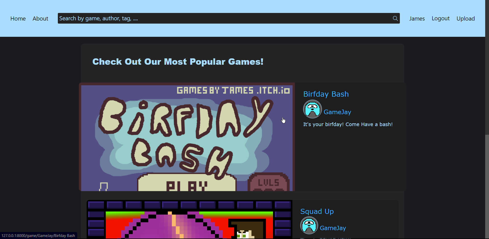
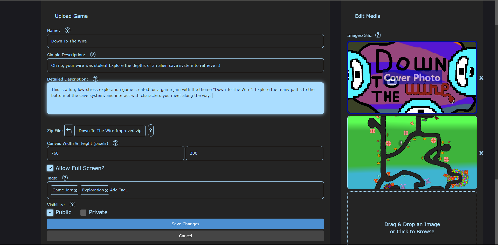
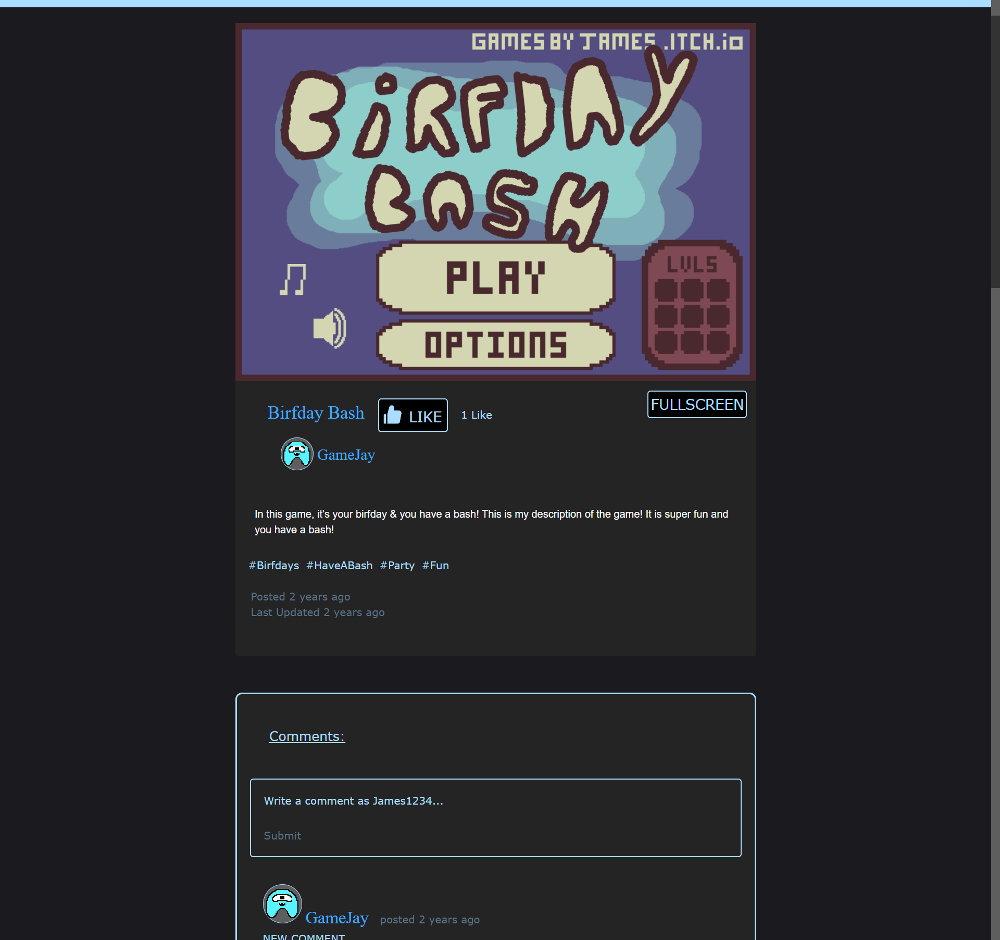
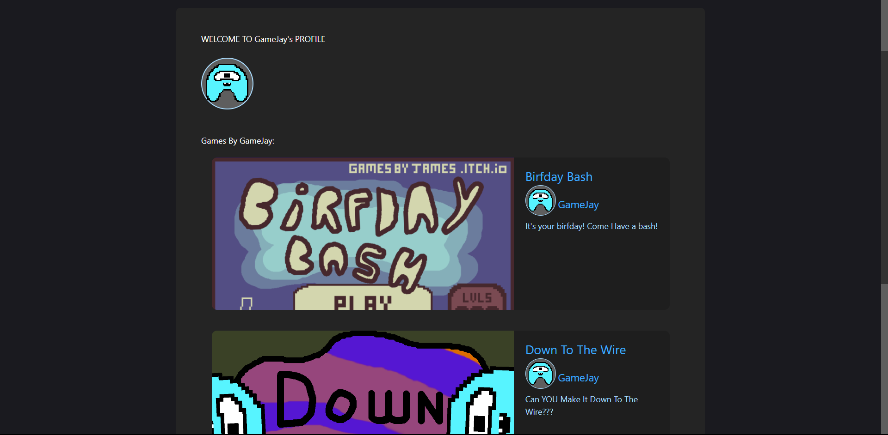

# GameJay
I made this website for posting games back in the Summer of 2021. I made it with [itch.io](https://itch.io) as a major inspiration. This project was my introduction to front-end web development, so I learned a lot but this project has some issues. The main concerns are security threats (if this were served as a public website) and long load times, neither of which has a trivial solution.

### The home page lets you browse some of the most liked games.

### It was important to me that the upload page would be simple for the end user. I wanted anybody interested to be able to upload their games to my website.


### Page for playing an uploaded game.

### Search for users by username or games by name, author, tag, etc.

### User Profile.


## Set Up
Copy .example.env to a new .env and configure it according to your machine's requirements. The variables you'll most likely need to configure are related to App configuration ```APP_KEY```, ```APP_URL```, Database configuration ```DB_*```, and Email delivery platform configuration ```MAIL_*```

Start your database (I use MySQL) and run ```php artisan serve```