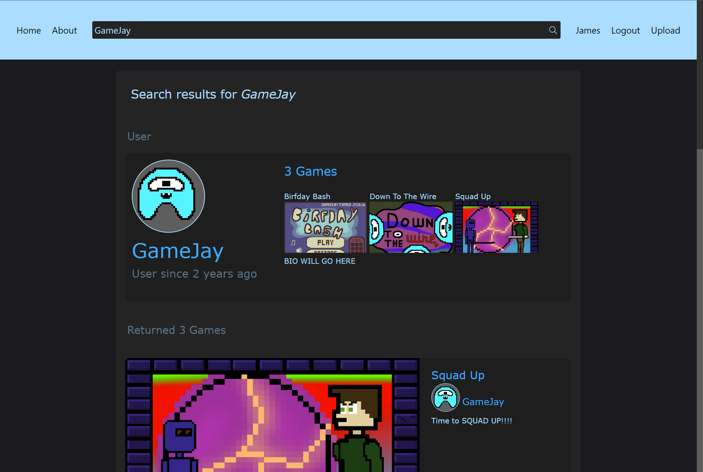

# GameJay
I made this website for playing and uploading web games back in the Summer of 2021. A major inspiration was [itch.io](https://itch.io). 

This project was my introduction to front-end web development, so I learned a lot but the result also has some issues. The main concerns are that a) security threats would be present if the website were transitioned to a public setting, and b)  elements of the server's structure cause significantly long load times. The website's looks and functionality were 95% complete, but I was prevented from finishing the site by the start of the Fall semester at ASU.

### The home page lets you browse some of the most popular games.


### It was important to me that the upload page would be simple for the end user. I wanted anybody with an existing game to be able to upload it to my website with minimal effort.


### Page for playing an uploaded game.


### Search for users by username or games by name, author, tag, etc.


### User Profile.


## Set Up
Copy .example.env to a new .env and configure it according to your machine's requirements. The variables you'll most likely need to configure are related to App configuration ```APP_KEY```, ```APP_URL```, Database configuration ```DB_*```, and Email delivery platform configuration ```MAIL_*```

Start your database (I use MySQL) and run ```php artisan serve```